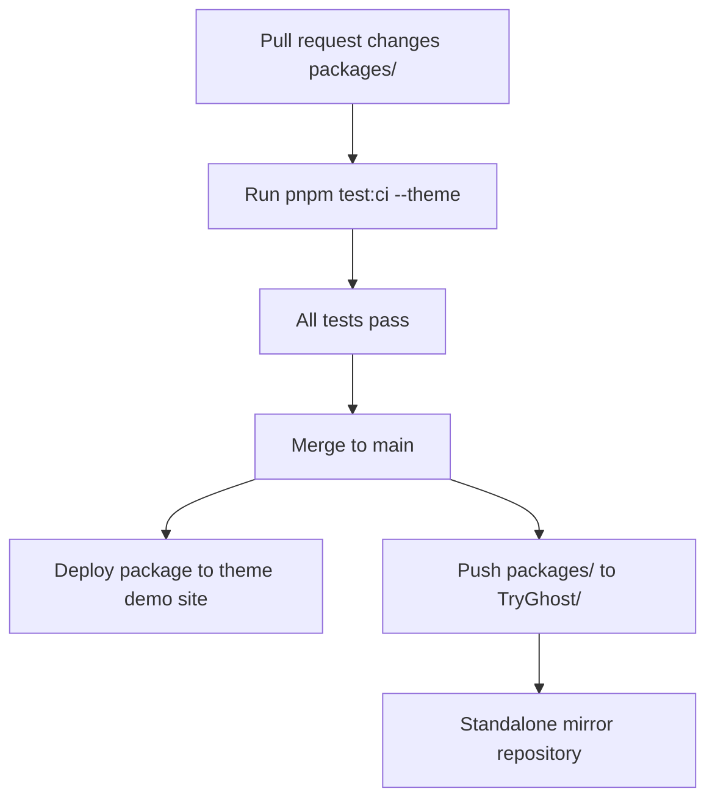

# Themes Architecture

The `TryGhost/Themes` repository is the source of truth for official theme package content. Each package under `packages/<theme>/` is a complete Ghost theme that is tested and shipped from this monorepo, then mirrored to its standalone `TryGhost/<Theme>` repository by CI.

## Subtree workflow

Package changes should be made in `packages/<theme>/`. The per-theme workflow tests that package, deploys it to the matching demo site, and force-pushes the package directory to the standalone mirror repository. Repo-level settings on the standalone mirror, such as descriptions and branch rulesets, are managed on the mirror repository itself.

## Package boundaries

- Source CSS, JavaScript, templates, partials, locales, and package metadata belong inside the relevant `packages/<theme>/` directory.
- Shared CSS, JavaScript, and partials belong in `packages/_shared/` and are published as `@tryghost/shared-theme-assets`.
- Shared translations belong in `packages/theme-translations/` and are published as `@tryghost/theme-translations`.
- Standalone mirror repositories receive package content from subtree sync; direct content edits there can be overwritten by the next sync.

## CI boundaries

Per-theme workflows live at `.github/workflows/<theme>.yml`. Each workflow scopes validation by passing the package name to `pnpm test:ci --theme <theme>`, then performs deploy and subtree work after merge. Do not add separate package-local workflow files for monorepo packages; the root workflows are the source of truth.
